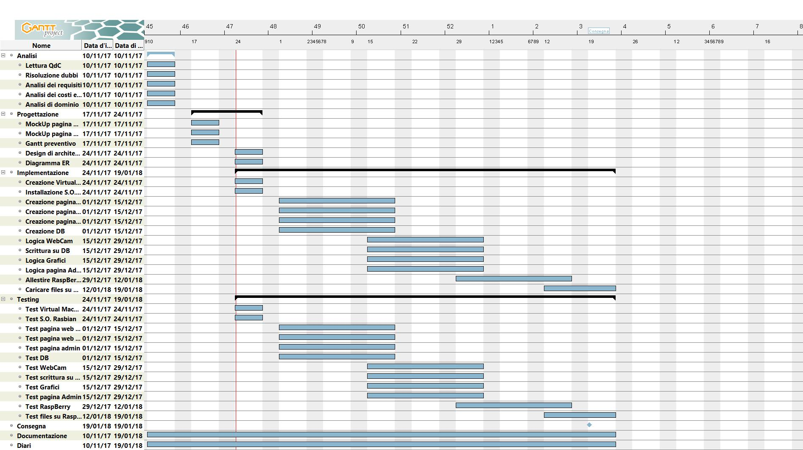
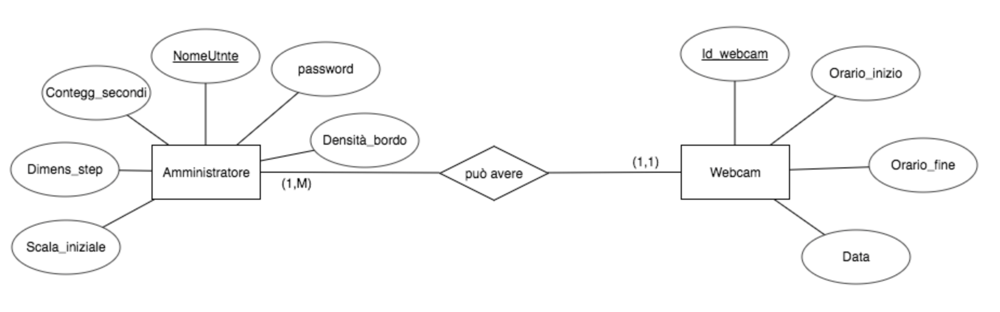
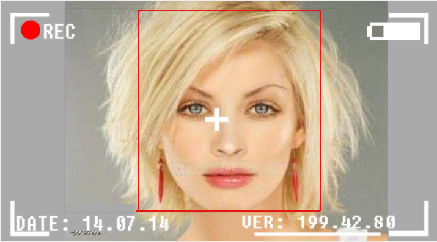
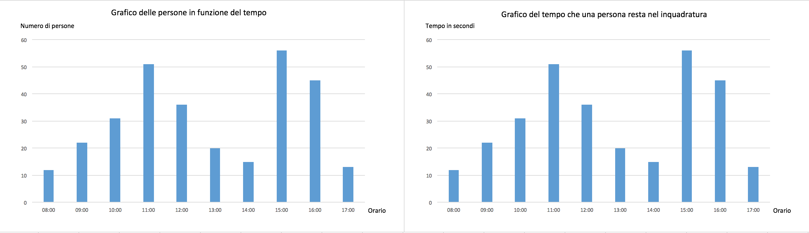
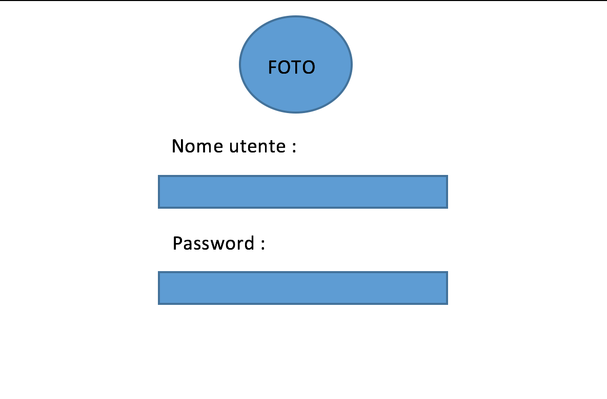
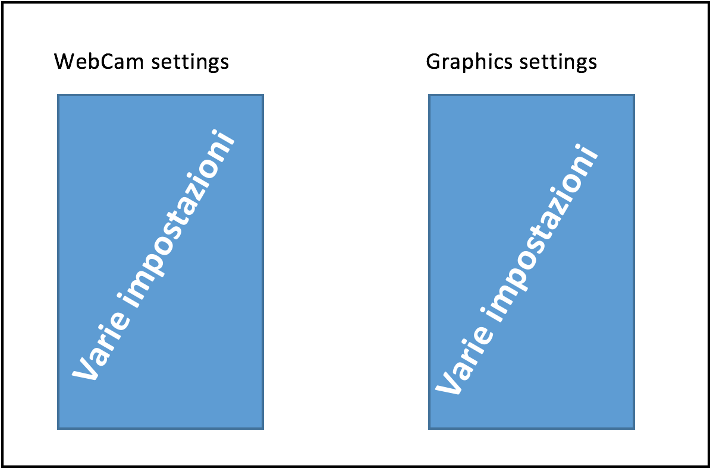
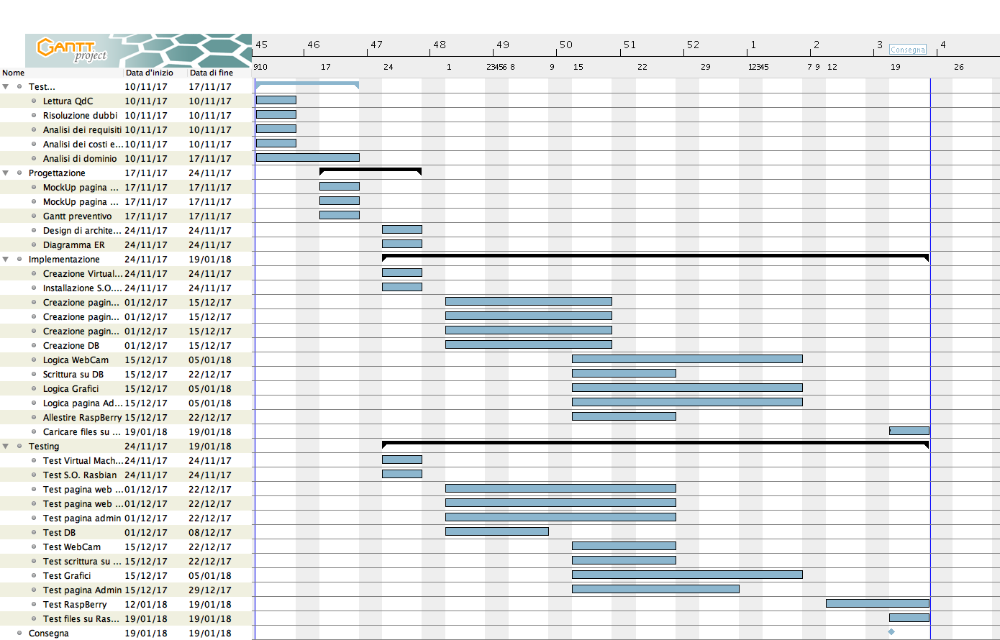

1. [Introduzione](#introduzione)

  - [Informazioni sul progetto](#informazioni-sul-progetto)

  - [Abstract](#abstract)

  - [Scopo](#scopo)

1. [Analisi](#analisi)

  - [Analisi del dominio](#analisi-del-dominio)
  
  - [Analisi dei mezzi](#analisi-dei-mezzi)

  - [Analisi e specifica dei requisiti](#analisi-e-specifica-dei-requisiti)

  - [Use case](#use-case)

  - [Pianificazione](#pianificazione)

1. [Progettazione](#progettazione)

  - [Design dell’architettura del sistema](#design-dell’architettura-del-sistema)

  - [Design dei dati e database](#design-dei-dati-e-database)

1. [Implementazione](#implementazione)

1. [Test](#test)

  - [Protocollo di test](#protocollo-di-test)

  - [Risultati test](#risultati-test)

  - [Mancanze/limitazioni conosciute](#mancanze/limitazioni-conosciute)

1. [Consuntivo](#consuntivo)

1. [Conclusioni](#conclusioni)

  - [Sviluppi futuri](#sviluppi-futuri)

  - [Considerazioni personali](#considerazioni-personali)

1. [Sitografia](#sitografia)

1. [Allegati](#allegati)

## Introduzione

### Informazioni sul progetto

 - **Progetto svolto da:** Gionata Battaglioni, Fabio Gola,Gabriele Dominelli, Lucas Previtali
 - **Mandanti del progetto:** Luca Muggiasca
 - **Docente Responsabile:** Luca Muggiasca
 - **Scuola:** Arti e Mestieri Trevano
 - **Sezione:** Informatica
 - **Classe:** I3AA
 - **Data d’inizio:** 10.11.2017
 - **Termine della consegna:** 19.01.2018

### Abstract

  E’ una breve e accurata rappresentazione dei contenuti di un documento,
  senza notazioni critiche o valutazioni. Lo scopo di un abstract efficace
  dovrebbe essere quello di far conoscere all’utente il contenuto di base
  di un documento e metterlo nella condizione di decidere se risponde ai
  suoi interessi e se è opportuno il ricorso al documento originale.

  Può contenere alcuni o tutti gli elementi seguenti:

  -   **Background/Situazione iniziale**

  -   **Descrizione del problema e motivazione**: Che problema ho cercato
      di risolvere? Questa sezione dovrebbe includere l'importanza del
      vostro lavoro, la difficoltà dell'area e l'effetto che potrebbe
      avere se portato a termine con successo.

  -   **Approccio/Metodi**: Come ho ottenuto dei progressi? Come ho
      risolto il problema (tecniche…)? Quale è stata l’entità del mio
      lavoro? Che fattori importanti controllo, ignoro o misuro?

  -   **Risultati**: Quale è la risposta? Quali sono i risultati? Quanto è
      più veloce, più sicuro, più economico o in qualche altro aspetto
      migliore di altri prodotti/soluzioni?

  Esempio di abstract:

  > *As the size and complexity of today’s most modern computer chips
  > increase, new techniques must be developed to effectively design and
  > create Very Large Scale Integration chips quickly. For this project, a
  > new type of hardware compiler is created. This hardware compiler will
  > read a C++ program, and physically design a suitable microprocessor
  > intended for running that specific program. With this new and powerful
  > compiler, it is possible to design anything from a small adder, to a
  > microprocessor with millions of transistors. Designing new computer
  > chips, such as the Pentium 4, can require dozens of engineers and
  > months of time. With the help of this compiler, a single person could
  > design such a large-scale microprocessor in just weeks.*

### Scopo

  Lo scopo del progetto è di creare un sistema di riconoscimento facciale tramite una webcam. Questo sistema serve per quantificare il numero di persone che visitano uno stand di Espoprofessioni. Il sistema deve essere in grado di riconoscere le persone che entrano nel campo visivo della webcam.

## Analisi

### Analisi del dominio

  Il progetto completo verrà presentato alla prossima edizione di Espoprofessioni, perciò sarà presentato principalmente a un pubblico di ragazzi e ragazze non per forza appassionati di informatica (in generale il gli “utenti” saranno variegati). Il pubblico presente sarà lì soprattutto per vedere diverse professioni e molti saranno studenti. Per capire il funzionamento del sistema non bisogna essere per forza esperti o appassionati di informatica.

  
### Analisi e specifica dei requisiti

  Il committente richiede una pagina web che effettua un riconoscimento facciale. Una volta che la faccia viene riconosciuta dalla pagina viene salvata all`interno di una variabile e a sua volta salvata in un database. In base al numero di persone riconosciute e al tempo che le persone rimangono ferme davanti alla web cam viene redatto un grafico. Mentre un secondo grafico veiene redatto in base al numero di persone che sono state riconosciute dalla webcam e alla fascia oraria. 

  
  |ID  |REQ-001                                        |
  |----|------------------------------------------------|
  |**Nome**    |Face Detection |
  |**Priorità**|1                     |
  |**Versione**|1.0                   |
  |**Note**    ||
  |**Sub-ID**    | Requisito|
  |**001**      | Creazione macchina virtuale  |
  |**002**      | Creazione pagina Web per webcam             |
  |**003**      | Creazione pagina Web per grafici            |
  |**004**      | Creazione pagina web per gestione dell’admin|                
  |**005**      | Creare una banca dati                |
  |**006**      | Ricerca di nuovi volti               |
  |**007**      | Salvataggio delle persone su DB             |
  |**008**      | Utilizzo del prodotto su RaspBerry          |

  |ID  |REQ-002                                        |
  |----|------------------------------------------------|
  |**Nome**    |Creazione macchina virtuale |
  |**Priorità**|1                     |
  |**Versione**|1.0                   |
  |**Note**    ||
  |**Sub-ID**    |Requisito |
  |**001**      | Si deve creazione macchina virtuale su “Virtual Box” |
  |**002**      | Si deve installare di XAMPP v7.0.2            |
  |**003**      | Si deve creare la struttura in cartelle che ospita i file   del progetto.           |
  
   |ID  |REQ-003                                        |
  |----|------------------------------------------------|
  |**Nome**    |Creazione pagina Web per webcam |
  |**Priorità**|1                     |
  |**Versione**|1.0                   |
  |**Note**    ||
  |**Sub-ID**    |Requisito |
  |**001**      |Si deve implementare una rappresentazione della webcam|
  |**002**      | Si deve organizzare e realizzare una interfaccia grafica    |
  
  |ID  |REQ-004                                        |
  |----|------------------------------------------------|
  |**Nome**    |Creazione pagina Web per grafici |
  |**Priorità**|1                     |
  |**Versione**|1.0                   |
  |**Note**    ||
  |**Sub-ID**    |Requisito |
  |**001**      | Si deve implementare la lettura dal DB |
  |**002**      | Si devono creare 2 grafici: Numero di persone rilevate in ogni ora del giorno. Tempo medio di una persona di fronte all’obiettivo.|
  |**003**      | Si deve poter utilizzare un form di log in per il REQ-005           |
  
   |ID  |REQ-005                                        |
  |----|------------------------------------------------|
  |**Nome**    |Creazione pagina Web per gestione dell’admin |
  |**Priorità**|2                     |
  |**Versione**|1.0                   |
  |**Note**    ||
  |**Sub-ID**    |Miglioria |
  |**001**      |Si deve creare un pannello di gestione per le impostazioni della WebCam.|
  |**002**      | Si deve creare un pannello di gestione per le impostazioni di Tracking.    |
  
  |ID  |REQ-006                                        |
  |----|------------------------------------------------|
  |**Nome**    |Creare una banca dati |
  |**Priorità**|1                     |
  |**Versione**|1.0                   |
  |**Note**    ||
  |**Sub-ID**    |Miglioria |
   |**001**      |Si deve creare un DB che ospiterà le persone tramite: 	Tempo di fronte all’obiettivo e ora del tracking.|
   
   |ID  |REQ-007                                        |
  |----|------------------------------------------------|
  |**Nome**    |Ricerca di nuovi volti |
  |**Priorità**|1                     |
  |**Versione**|1.0                   |
  |**Note**    ||
  |**Sub-ID**    |Requisito |
  |**001**      | Si deve scegliere la libreria migliore per il tracking dei volti: openCV, tracking.js |
  |**002**      |Si deve implementare il codice JavaScript per l’individuazione dei dati tramite libreria.|
  |**003**      | La webcam deve eseguire la ricerca di nuovi volti ogni 15 secondi e se rileva dei volti nelle coordinate vicine a quelle vecchie, non ne terrà conto.|
  
  |ID  |REQ-008                                        |
  |----|------------------------------------------------|
  |**Nome**    |Salvataggio delle persone sul DB |
  |**Priorità**|1                     |
  |**Versione**|1.0                   |
  |**Note**    ||
  |**Sub-ID**    |Miglioria |
   |**001**      |Si deve gestire il codice PHP del sito web per il corretto invio dei dati al DB.|
  
  |ID  |REQ-009                                        |
  |----|------------------------------------------------|
  |**Nome**    |Utilizzo del prodotto su RaspBerry |
  |**Priorità**|1                     |
  |**Versione**|1.0                   |
  |**Note**    ||
  |**Sub-ID**    |Requisito |
  |**001**      | Si deve allestire un webserver Linux su RaspBerry|
  |**002**      |Si deve trasporre l’intero codice del progetto su RaspBerry|
  |**003**      | Si deve poter connettere 1 WebCam e 2 schermi contemporaneamente per input e output.|

 

### Use case

I casi d’uso rappresentano l’interazione tra i vari attori e le
funzionalità del prodotto.

### Pianificazione

Questo é il Gantt che abbiamo realizzato in base alla lista dei requisiti che abbiamo redatto e al tempo a disposizione.

### Analisi dei mezzi
Come prodotti finisci abbiamo usato i seguenti:

| Proodotto | Caratteristiche |
|    :--    |    --:    |
|  Raspberry Pi3  |  so. raspbian 9.0  |
|  tastiera K200  |  Logitech  |
|  Mouse  |  Lenovo  |
|  Monitor HDMI  |  Asus  |
|  Televisore (da definire) |  XXXXXX  |
|  Webcam (XXX) |  Logitech  |

Mentre come prodotti virtuali abbiamo usato la libreria [tracking.js](https://trackingjs.com/).
Il Raspberry é stato trasformato in un webserver, all`intreno abbiamo scaricato le seguenti versioni: 

| Pacchetto| Versione |
|    :--    |    --:    |
|  Apache  |   2.4.25 |
|  Php  |  7.0.19  |
|  MariaDB  |  10.1.23  |

### Analisi dei costi
#### Costo per persona:
È stimato che un apprendista al nostro stesso livello guadagni circa 80 franchi all`ora.

|Costo per ora:    |Ore        |Totale        |
|------------------|-----------|--------------|
|60                |48         |2880 fr.      |

#### Costo totale (dipendenti):
Essendo quattro persone a lavorare in questo progetto, i costi vanno moltiplicati.

|Costo per ora   |Ore   |persone  |Totale     |
|----------------|------|---------|-----------|
|60              |48    |4        |11520 fr.  |

#### Costo webcam:
Dopo qualche ricerca abbiamo trovato la webcam adatta al nostro progetto e il presso é di:

|Totale          |
|----------------|
|29 fr.          |

#### Costo totale:
Facendo una somma dei vari totali arriviamo al costo totale finale di questo progetto.

|Totale          |
|----------------|
|11560 fr.       |

## Progettazione

### Design dell’architettura del sistema

Descrive:

-   La struttura del programma/sistema lo schema di rete...

-   Gli oggetti/moduli/componenti che lo compongono.

-   I flussi di informazione in ingresso ed in uscita e le
    relative elaborazioni. Può utilizzare *diagrammi di flusso dei
    dati* (DFD).

-   Eventuale sitemap

### Design dei dati e database

Il database che abbiamo creato è molto basico. Presenta due tabelle, la tabella Amministratore dove vengono contenuti i seguenti campi(NomeUtente(PK),Id_WebCam(FK),Password,Densità_Bordo,Conteggio_Secondi, Dimensione_step,Scala_iniziale). Mentre la seconda tabella chiamata WebCam che contiene (Id_Webcam(PK),Orario_inizio,Orario_fine,Data). Le due tabelle sono collegate tramite una relazione molti a uno chiamata "può avere".

### Schema E-R, schema logico e descrizione.

Questo é il diagramma ER del database generato per consentire lo scambio dei dati tramite le varie pagine web.

### Design delle interfacce

Prima di iniziare a scrivere il codice abbiamo scelto assime al gurppo una truttura base sel sito, di come vorremmo che esso diventi. 
Per la pagina che riguarda la webcam, cioè dove l`utente vede sè stesso abbiamo pensato a un approccio molto minimale.

Mentre per la pagina dove verranno inseriti i grafici abbiamo pensato a un approccio un po meno minimale ma più adatto alla situazione.

Per la terza e ultima pagina cioè la pagina dove l` amminitratore potrà cambiare le impostazioni della webcam o della pagina. Come prima cosa dovrà coparire la pagina di login:

Secondariamente una volta effettuato il login. L` amministratore avrà il diritto di cambiare le impostazioni a suo piacimento.

### Design procedurale

Descrive i concetti dettagliati dell’architettura/sviluppo utilizzando
ad esempio:

-   Diagrammi di flusso e Nassi.

-   Tabelle.

-   Classi e metodi.

-   Tabelle di routing

-   Diritti di accesso a condivisioni …

Questi documenti permetteranno di rappresentare i dettagli procedurali
per la realizzazione del prodotto.

## Implementazione

In questo capitolo dovrà essere mostrato come è stato realizzato il
lavoro. Questa parte può differenziarsi dalla progettazione in quanto il
risultato ottenuto non per forza può essere come era stato progettato.

Sulla base di queste informazioni il lavoro svolto dovrà essere
riproducibile.

In questa parte è richiesto l’inserimento di codice sorgente/print
screen di maschere solamente per quei passaggi particolarmente
significativi e/o critici.

Inoltre dovranno essere descritte eventuali varianti di soluzione o
scelte di prodotti con motivazione delle scelte.

Non deve apparire nessuna forma di guida d’uso di librerie o di
componenti utilizzati. Eventualmente questa va allegata.

Per eventuali dettagli si possono inserire riferimenti ai diari.

## Test

### Protocollo di test

Definire in modo accurato tutti i test che devono essere realizzati per
garantire l’adempimento delle richieste formulate nei requisiti. I test
fungono da garanzia di qualità del prodotto. Ogni test deve essere
ripetibile alle stesse condizioni.

|Test Case      | TC-002                              |
|---------------|--------------------------------------|
|**Nome**       |Creazione macchina virtuale |
|**Riferimento**|REQ-002                               |
|**Descrizione**|Creazione macchina virtuale per gestire le cartelle su raspberry|
|**Prerequisiti**||
|**Procedura**     | - Installare un programma per gestire le macchine virtuali, noi abbuamo usato VirtualBox. - Creare una macchina virtuale linux basata su raspbian, in questo caso abbiamo usato debian|
|**Risultati attesi** |Avere la stessa struttura di caretelle che é presente su raspbian.|

|Test Case      | TC-003                               |
|---------------|--------------------------------------|
|**Nome**       |Creazione pagina Web per webcam|
|**Riferimento**|REQ-003                               |
|**Descrizione**|Gestire il riconoscimento facciale|
|**Prerequisiti**|- |
|**Procedura**     | - Scaricare la libreria traking.js - Modificare la libreira con il linguaggio JavaScript. |
|**Risultati attesi** |Avere la pagina web che riconosce le faccie e manda le informazioni al database|

|Test Case      | TC-004                               |
|---------------|--------------------------------------|
|**Nome**       |Creazione pagina Web per grafici |
|**Riferimento**|REQ-004                               |
|**Descrizione**|Gestire i dati mandati dalla pagina web della webcam tramite dei grafici|
|**Prerequisiti**|- |
|**Procedura**     | - Creare i grafici - Prendere i dati dal database e inserirli all`inerno dei grafici.|
|**Risultati attesi** |I grafici vengono mostrati correttamente in base hai dati presi dal database. |

|Test Case      | TC-005                               |
|---------------|--------------------------------------|
|**Nome**       |Creazione pagina Web per gestione dell’admin|
|**Riferimento**|REQ-005                               |
|**Descrizione**|Creazione di una pagina inserente all`accesso asmin per la modifica dei parametri della webcam |
|**Prerequisiti**|Aver creato la pagina web per la Webcam |
|**Procedura**     | - Creare un login con l`uso di JavaScript - Gestire la pagina Amministratore inserendo i parametri di modifica.|
|**Risultati attesi** |L`utente admin riesce a accedere alla pagina e a modificare i parametri.|

|Test Case      | TC-006                               |
|---------------|--------------------------------------|
|**Nome**       |Creare una banca dati |
|**Riferimento**|REQ-006                               |
|**Descrizione**|Creazione di una bancadati che contiene i dati raccolti dalla pagina web della Webcam|
|**Prerequisiti**|Aver creato la pagina della webCam|
|**Procedura**     | - Scaricare un programma per creare il database, noi abbiamo utlitzzato Heidi - Cre<re il database con gli stessi parametri della libreira presa e del codice scritto nella pagian web della Webcam.|
|**Risultati attesi** |Il database riesce a prendere i dati delle pagine prescritte|

|Test Case      | TC-007                               |
|---------------|--------------------------------------|
|**Nome**       |Ricerca di nuovi volti |
|**Riferimento**|REQ-007                               |
|**Descrizione**|I volti vengono trovati dalla pagina della Webcam|
|**Prerequisiti**|Download libreria tracking.js |
|**Procedura**     | - Aver installato la libreria tracking.js - Gestire il riconoscimento facciale tramite JavaScript |
|**Risultati attesi** |La pagina della Webcam é in grado di riconoscre i volti|

|Test Case      | TC-008                               |
|---------------|--------------------------------------|
|**Nome**       |Salvataggio delle persone sul DB|
|**Riferimento**|REQ-008                               |
|**Descrizione**|Questo test serve per verificare il corretto funzionamento dell`immissione dei dati all`interno del database|
|**Prerequisiti**|aver creato il database|
|**Procedura**     | - Collegare il database alle pagine tramite php |
|**Risultati attesi** |I dati presi dalla webcam sono presenti all`interno del databse |

|Test Case      | TC-009                               |
|---------------|--------------------------------------|
|**Nome**       |Utilizzo del prodotto su RaspBerry|
|**Riferimento**|REQ-009                               |
|**Descrizione**|Installazione del sitema operativo su Rasberry e installazione webserver|
|**Prerequisiti**|avere un Raspberry|
|**Procedura**     | - Caricare l`immagine del sistema operativo sul raspberry - Installare un webserver tramite in comandi opportuni|
|**Risultati attesi** |Raspberry é effetivamente un webserver.|

### Risultati test

Tabella riassuntiva in cui si inseriscono i test riusciti e non del
prodotto finale. Se un test non riesce e viene corretto l’errore, questo
dovrà risultare nel documento finale come riuscito (la procedura della
correzione apparirà nel diario), altrimenti dovrà essere descritto
l’errore con eventuali ipotesi di correzione.

### Mancanze/limitazioni conosciute

Per noi é stata difficile la partenza, cioè suddividerci il lavoro e imparare a lavorare come un team. Una volta capito il vero funzionamento del lavoro di squadra e una volta che abbiamo suddiviso i compiti siamo riusciti a arrivare ad avere un vero e proprio team organizzato. Per quanto riguarda le competenze informatiche abbiamo avuto qualche difficolta con l` utilizzo di programmi o linguaggi che non abbiamo mai usato. Come per esempio raspberry, abbiamo dovuto installare il suo sistema operativo (raspbian) e installare un webserver su esso.

## Consuntivo

Ecco come sono andate le ore di lavoro, in base a quelle che abbiamo programmato prima dell`inizio del progetto.

## Conclusioni

La soluzione che abbiamo portato ci soddisfa ma non al 100%. Il nostro programma avrà sicuramente un impatto positivo con le persone che lo proveranno, porterà molto divertimento. Noi non pensiamo che il nostro programma cambierà il mondo ma siamo sicuri che porterà una piccola svolta, sicurament più per noi stessi che per gli altri. Possiamo definire questo progetto un successo importante, più che successo questo progetto ci porta un forte orgoglio personale sopratutto perchè verrà utilizzato da gente esterna alla nostra scuola. Questo progetto é una grande aggiunta alla nostra crescita professionale, ci ha dato molto questo progetto sia come competenze lavorative che come competenze sociali.

### Sviluppi futuri
 Come miglioria potrebbe essere implementato in una scala molto più grande rispetto che un semplice schermo con una webcam. Sarebbe bello poter collegare il nostro progetto su delle videocamere reali in modo da riuscire a riconoscere una quantità maggiore di volti. Mentre come sviluppo futuro vorremmo riuscire a migliorare il nostro prodotto, in modo da avere un programma che funzioni alla perfezione.

### Considerazioni personali
  Con questo progetto abbiamo imparato cosa vuol dire lavoro di squadra, di quanto esso sia estremamente importante e di come con dei collaboratori sia più facile e eccitante lavorare.

## Sitografia

- https://trackingjs.com/, *Tracking.js
    La libreira per implementare il riconoscimento facciale.
    
- https://www.wikihow.it/Creare-un-Web-Server-su-Raspberry-Pi, *Manuale web-server linux
    Abbiamo usato questo sito per creare un web server su raspberry.
    
- https://www.raspberrypi.org/downloads/raspbian/, *Sitema operativo Raspbian
    Abbamo scaricato il sistema operativo direttamente dal sito del produttore di raspberry.
    
- http://www.vemp.org/raspberrypi/preparare-una-card-sd-con-raspbian/, *Programma per caricare il .img di raspbian su raspberry.
- https://www.w3schools.com/js/, *Guida JavaScript
    Abbiamo utilizzato questa guida per eventuali errori o mancanze delle nostre competenze sul linguaggio.
    
- https://www.w3schools.com/php/, *Giuida Php
    Abbiamo utlizzato questa guida in caso di mancanze o scarse competenze.
    

## Allegati

Elenco degli allegati, esempio:

-   Diari di lavoro

-   Guida utente / Manuale di utilizzo

