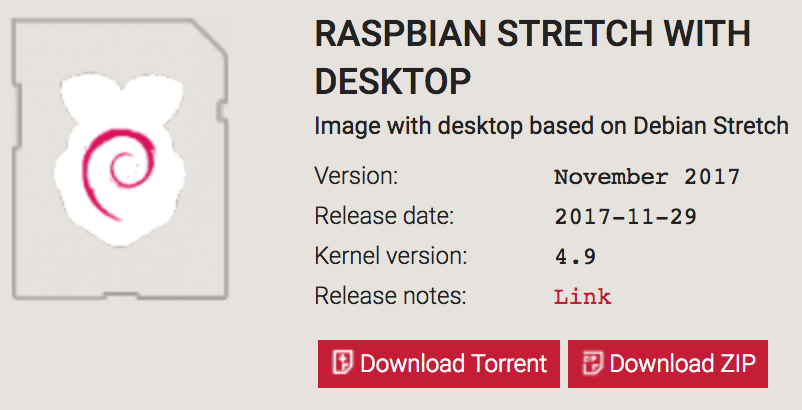
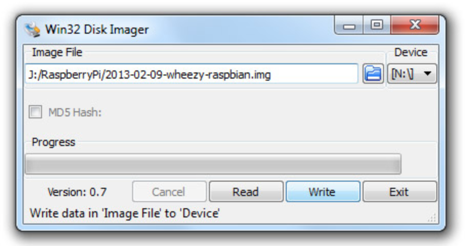
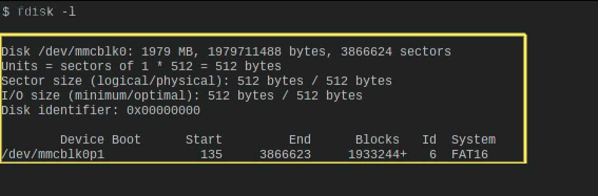
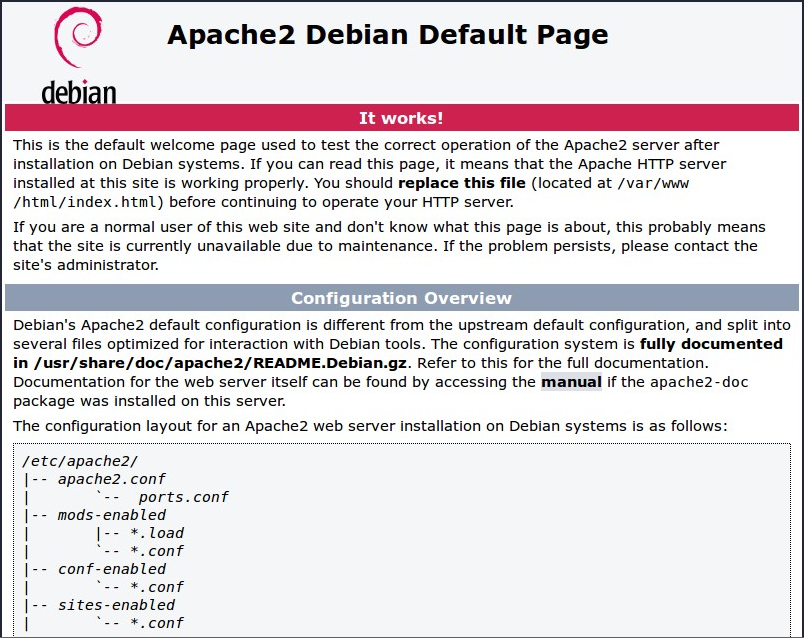
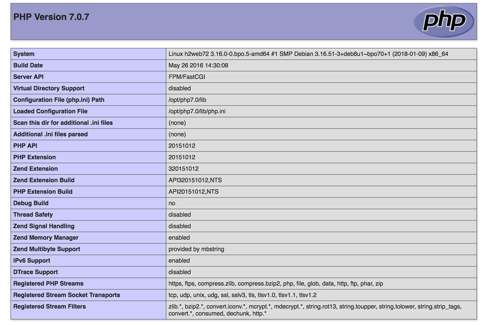

### Raspberry

In questo capitolo spiegheremo il perchè abbiamo usato Raspberry e come lo abbiamo utilizzato.
Abbimo scelto di utilizzare un Raspberry perchè ci sembrava al quanto scomodo lasciare un computer costantemente collegato alla televisione che andremo a utilizzare dutante la presetazione del nostro progetto a EspoProfessioni.

Per fare ciò abbiamo dovuto procurarci un Raspberry, e caricare il suo rispettivo sistema operativo.
Il sistema operativo si chiama Raspbian versione 4.9.
Abbiamo scelto la versione Desktop in modo da semplificarci il lavoro.

Una volta scaricato il sitema operativo abbiamo dovuto caricare l`immagine sull SD di Raspberry. Per fare ciò abbiamo dovuto utlizzare il seguente programma, Win32 Disk Imager.

Una volta fatto ciò siamo pronti per mettere il sistema operativo su Raspberry. 

Ora il sistema operativo è installato e adesso ci tocca installare Apache, Php e MariaDB
Per Apache abbiamo scelto la versione 2.4.25. Per poter installarlo abbiamo dovuto Prima di tutto collegarci a internet tramite il Raspberry, aprire il terminale e digitare i seguenti comandi.

`sudo get-update`

`sudo get-upgrade`

Una volta eseguito sia un update che un upgrade possiamo installare Apache.

`sudo apt-get install apache2 apache2-doc`

Eseguito il download bisgonera attivare il servizio:

`sudo /etc/init.d/apache2 restart` 

Per verificare il corretto funzionamento di Apache basta aprire una pagina web e digitare nella barra di ricerca localhost.
Se é stato installato correttamente apparirà la seguente pagina.

Una volta installato Apache abbiamo continuato intallando Php versione 7.0.19.
Tramite il seguente comando:

`sudo apt-get install php5`

Una volta installato il servizio Php bisgonerà creare il file test.php per verificare il corretto funzionamento.

`sudo nano /var/www/html/test.php`

Creato il file bisgonerà scrivere il seguente codice:

 ~~~php
<html>
 <head>
  <title>Test PHP</title>
 </head>
 <body>
  <?php 
  phpinfo();
  ?>
 </body>
 ~~~
  
 Se caricando la pagina test.php apparirà come la seguente immagine, il download é andato a buon fine.
 
 
 
 
Una volta fatto ciò abbiamo proseguito installando MariaDB versione 10.1.23.
Tramite il seguente comando:

`sudo apt-get install mariadb-server`